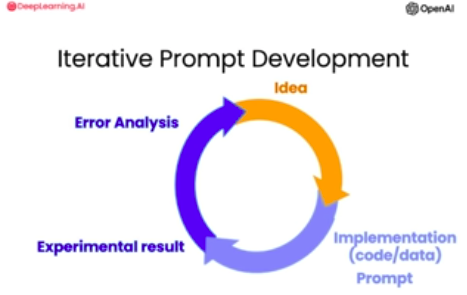

# Guidelines for Prompting

> In this lesson you'll proactice two pompting principles and
thier realated tactics in order to write effective prompts for
large language models.

> ## Principle 1
> - Write a clear and specific instructions.

> ## Priciple 2
> - Give the model time to think.
---

## Principle 1: Write clear and spesific instructions.

**Tactic 1: Use delimiters**
- Tripple quotes: """
- Tripple backticks: ```
- Triple dashes: ---
- Angle brackets: <>
- XML tags: \<tag>\</tag>

**Tactic 2: Ask for structured output.**
- HTML, JSON.

**Tactic 3: Check wheter conditions are satisfied**
- Check assumptions required to do the task.

**Tactic 4: Few-shot prompting
- Check assumptions required to do the task.

## Principle 2: Give the model time to think

**Tactic 1: Specify the steps to complete a task**
- Step 1: ...
- Step 2: ...
- ... 
- Step N: ...

**Tactic 2: Instruct the model to work out it's own solution before rushing to a conclution.**

**Model Limitations**
- Hallucination
- Makes statements that sound plausible but are not true.

# Iterative Prompt Development


**Iterative Process:**
- Try Something
- Analyze where the result does not give what you want.
- Clarify instruction, give more time to think.
- Refine prompts with a batch of examples.